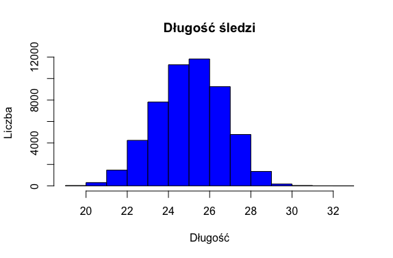
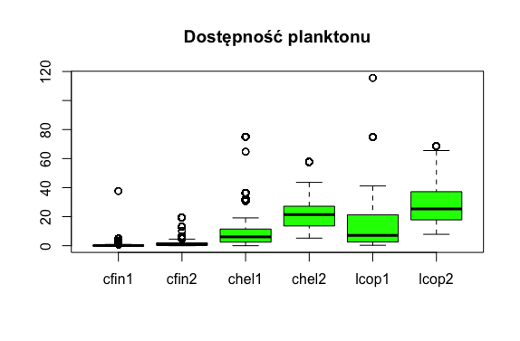
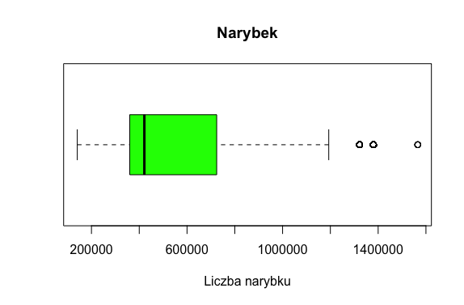
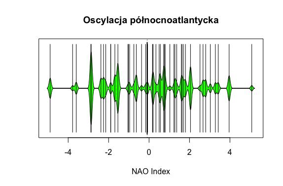
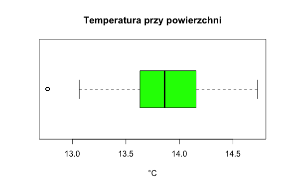
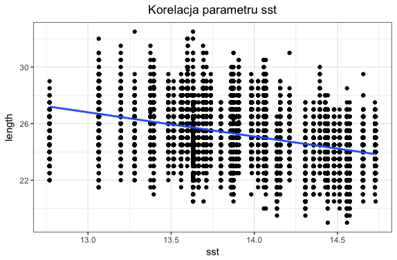
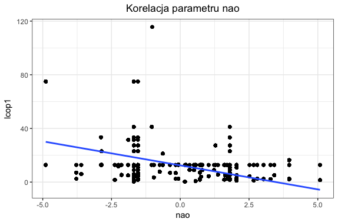
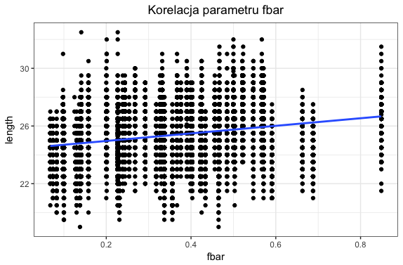
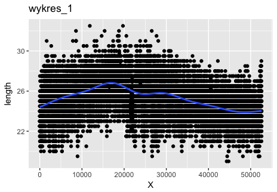

```{r setup, include=FALSE}
knitr::opts_chunk$set(echo = TRUE)
```


#Podsumowanie analizy

Celem projektu jest analiza wielkości śledzia oceanicznego wyławianego w wodach Europy.Dane do analizy zostały pobrane z połowów komercyjnych jednostek w latach 60.
W ramach połowu jednej jednostki losowo wybierano od 50 do 100 sztuk trzyletnich śledzi

W wyniku przeprowadzonej analizy można zauważyć, że wielkość śledzia uzależniona jest od temperatury wody przy powierzchni wody(sst) na którą silny wpływ ma oscylacja północnoatlantycka(nao) oraz natężenia połowów w regionie.

#Analiza danych źródłowych
``` r
#Biblioteki użyte do analizy

library(readr)       
library(knitr)      
library(ggplot2)
library(beanplot)
library(plotly)      
library(caret)       
library(randomForest)
```
#Prezentacja danych
```r
Dane źródłowe są dostępne w pliku http://www.cs.put.poznan.pl/dbrzezinski/teaching/sphd/sledzie.csv

Wczytywanie pobranych danych z laptopa
data_sledzie <- read.csv("~/Desktop/swrl/sledzie.csv", na.strings = "?",comment.char ="")
Liczba pobranych wierszy 52582.
```
```r

Kolumny w zbiorze danych to:

length: długość złowionego śledzia [cm];
cfin1: dostępność planktonu [zagęszczenie Calanus finmarchicus gat. 1];
cfin2: dostępność planktonu [zagęszczenie Calanus finmarchicus gat. 2];
chel1: dostępność planktonu [zagęszczenie Calanus helgolandicus gat. 1];
chel2: dostępność planktonu [zagęszczenie Calanus helgolandicus gat. 2];
lcop1: dostępność planktonu [zagęszczenie widłonogów gat. 1];
lcop2: dostępność planktonu [zagęszczenie widłonogów gat. 2];
fbar: natężenie połowów w regionie [ułamek pozostawionego narybku];
recr: roczny narybek [liczba śledzi];
cumf: łączne roczne natężenie połowów w regionie [ułamek pozostawionego narybku];
totaln: łączna liczba ryb złowionych w ramach połowu [liczba śledzi];
sst: temperatura przy powierzchni wody [°C];
sal: poziom zasolenia wody [Knudsen ppt];
xmonth: miesiąc połowu [numer miesiąca];
nao: oscylacja północnoatlantycka [mb].

Wiersze w zbiorze są uporządkowane chronologicznie.

tail(data_sledzie)
X length   cfin1   cfin2   chel1    chel2   lcop1    lcop2  fbar   recr      cumf
1 0   23.0 0.02778 0.27785 2.46875       NA 2.54787 26.35881 0.356 482831 0.3059879
2 1   22.5 0.02778 0.27785 2.46875 21.43548 2.54787 26.35881 0.356 482831 0.3059879
3 2   25.0 0.02778 0.27785 2.46875 21.43548 2.54787 26.35881 0.356 482831 0.3059879
4 3   25.5 0.02778 0.27785 2.46875 21.43548 2.54787 26.35881 0.356 482831 0.3059879
5 4   24.0 0.02778 0.27785 2.46875 21.43548 2.54787 26.35881 0.356 482831 0.3059879
6 5   22.0 0.02778 0.27785 2.46875 21.43548 2.54787       NA 0.356 482831 0.3059879
    totaln      sst      sal xmonth nao
1 267380.8 14.30693 35.51234      7 2.8
2 267380.8 14.30693 35.51234      7 2.8
3 267380.8 14.30693 35.51234      7 2.8
4 267380.8 14.30693 35.51234      7 2.8
5 267380.8 14.30693 35.51234      7 2.8
6 267380.8 14.30693 35.51234      7 2.8

```
#Podsumowanie rozmiaru zbiorów
```r
summary(data_sledzie)

  X             length         cfin1             cfin2             chel1       
 Min.   :    0   Min.   :19.0   Min.   : 0.0000   Min.   : 0.0000   Min.   : 0.000  
 1st Qu.:13145   1st Qu.:24.0   1st Qu.: 0.0000   1st Qu.: 0.2778   1st Qu.: 2.469  
 Median :26290   Median :25.5   Median : 0.1111   Median : 0.7012   Median : 5.750  
 Mean   :26290   Mean   :25.3   Mean   : 0.4458   Mean   : 2.0248   Mean   :10.006  
 3rd Qu.:39436   3rd Qu.:26.5   3rd Qu.: 0.3333   3rd Qu.: 1.7936   3rd Qu.:11.500  
 Max.   :52581   Max.   :32.5   Max.   :37.6667   Max.   :19.3958   Max.   :75.000  
                                NA's   :1581      NA's   :1536      NA's   :1555    
     chel2            lcop1              lcop2             fbar       
 Min.   : 5.238   Min.   :  0.3074   Min.   : 7.849   Min.   :0.0680  
 1st Qu.:13.427   1st Qu.:  2.5479   1st Qu.:17.808   1st Qu.:0.2270  
 Median :21.673   Median :  7.0000   Median :24.859   Median :0.3320  
 Mean   :21.221   Mean   : 12.8108   Mean   :28.419   Mean   :0.3304  
 3rd Qu.:27.193   3rd Qu.: 21.2315   3rd Qu.:37.232   3rd Qu.:0.4560  
 Max.   :57.706   Max.   :115.5833   Max.   :68.736   Max.   :0.8490  
 NA's   :1556     NA's   :1653       NA's   :1591                     
      recr              cumf             totaln             sst             sal       
 Min.   : 140515   Min.   :0.06833   Min.   : 144137   Min.   :12.77   Min.   :35.40  
 1st Qu.: 360061   1st Qu.:0.14809   1st Qu.: 306068   1st Qu.:13.60   1st Qu.:35.51  
 Median : 421391   Median :0.23191   Median : 539558   Median :13.86   Median :35.51  
 Mean   : 520366   Mean   :0.22981   Mean   : 514973   Mean   :13.87   Mean   :35.51  
 3rd Qu.: 724151   3rd Qu.:0.29803   3rd Qu.: 730351   3rd Qu.:14.16   3rd Qu.:35.52  
 Max.   :1565890   Max.   :0.39801   Max.   :1015595   Max.   :14.73   Max.   :35.61  
                                                       NA's   :1584                   
     xmonth            nao          
 Min.   : 1.000   Min.   :-4.89000  
 1st Qu.: 5.000   1st Qu.:-1.89000  
 Median : 8.000   Median : 0.20000  
 Mean   : 7.258   Mean   :-0.09236  
 3rd Qu.: 9.000   3rd Qu.: 1.63000  
 Max.   :12.000   Max.   : 5.08000 

```
#Puste wartości
W danym zbiorze występuje 11056 pustych rekordów.Jest to aż 21,03% danych całego zbioru.Brakujące wartości występuja przy atrybutach dotyczących dostępności planktonu (cfin1, cfin2, chel1, chel2, lcop1, lcop2) i temperatury przy powierzchni wody (sst). Puste dane NA zastąpiono średnimi danymi z danych kolumn.

```r
> sr_sledzie <- data_sledzie
> 
> sr_sledzie$chel2[which(is.na(sr_sledzie$chel2))] <- mean(sr_sledzie$chel2, na.rm = TRUE)
> sr_sledzie$chel1[which(is.na(sr_sledzie$chel1))] <- mean(sr_sledzie$chel1, na.rm = TRUE)
> sr_sledzie$cfin1[which(is.na(sr_sledzie$cfin1))] <- mean(sr_sledzie$cfin1, na.rm = TRUE)
> sr_sledzie$cfin2[which(is.na(sr_sledzie$cfin2))] <- mean(sr_sledzie$cfin2, na.rm = TRUE)
> sr_sledzie$lcop1[which(is.na(sr_sledzie$lcop1))] <- mean(sr_sledzie$lcop1, na.rm = TRUE)
> sr_sledzie$lcop2[which(is.na(sr_sledzie$lcop2))] <- mean(sr_sledzie$lcop2, na.rm = TRUE)
> sr_sledzie$sst[which(is.na(sr_sledzie$sst))] <- mean(sr_sledzie$sst, na.rm = TRUE)

```
#Podsumowanie wartości zbioru danych bez wartości pustych NA

```r
> summary(sr_sledzie)
       X             length         cfin1             cfin2             chel1       
 Min.   :    0   Min.   :19.0   Min.   : 0.0000   Min.   : 0.0000   Min.   : 0.000  
 1st Qu.:13145   1st Qu.:24.0   1st Qu.: 0.0000   1st Qu.: 0.2778   1st Qu.: 2.469  
 Median :26290   Median :25.5   Median : 0.1333   Median : 0.7012   Median : 6.083  
 Mean   :26290   Mean   :25.3   Mean   : 0.4458   Mean   : 2.0248   Mean   :10.006  
 3rd Qu.:39436   3rd Qu.:26.5   3rd Qu.: 0.3603   3rd Qu.: 1.9973   3rd Qu.:11.500  
 Max.   :52581   Max.   :32.5   Max.   :37.6667   Max.   :19.3958   Max.   :75.000  
     chel2            lcop1              lcop2             fbar       
 Min.   : 5.238   Min.   :  0.3074   Min.   : 7.849   Min.   :0.0680  
 1st Qu.:13.589   1st Qu.:  2.5479   1st Qu.:17.808   1st Qu.:0.2270  
 Median :21.435   Median :  7.1229   Median :25.338   Median :0.3320  
 Mean   :21.221   Mean   : 12.8108   Mean   :28.419   Mean   :0.3304  
 3rd Qu.:27.193   3rd Qu.: 21.2315   3rd Qu.:37.232   3rd Qu.:0.4560  
 Max.   :57.706   Max.   :115.5833   Max.   :68.736   Max.   :0.8490  
      recr              cumf             totaln             sst             sal       
 Min.   : 140515   Min.   :0.06833   Min.   : 144137   Min.   :12.77   Min.   :35.40  
 1st Qu.: 360061   1st Qu.:0.14809   1st Qu.: 306068   1st Qu.:13.63   1st Qu.:35.51  
 Median : 421391   Median :0.23191   Median : 539558   Median :13.86   Median :35.51  
 Mean   : 520366   Mean   :0.22981   Mean   : 514973   Mean   :13.87   Mean   :35.51  
 3rd Qu.: 724151   3rd Qu.:0.29803   3rd Qu.: 730351   3rd Qu.:14.16   3rd Qu.:35.52  
 Max.   :1565890   Max.   :0.39801   Max.   :1015595   Max.   :14.73   Max.   :35.61  
     xmonth            nao          
 Min.   : 1.000   Min.   :-4.89000  
 1st Qu.: 5.000   1st Qu.:-1.89000  
 Median : 8.000   Median : 0.20000  
 Mean   : 7.258   Mean   :-0.09236  
 3rd Qu.: 9.000   3rd Qu.: 1.63000  
 Max.   :12.000   Max.   : 5.08000 
```
#Analiza wartości atrybutów
```r
hist(sr_sledzie$length, main="Długość śledzi",xlab="Długość",ylab="Liczba", col="blue")
```

```r
boxplot(sr_sledzie[3:8], main = "Dostępność planktonu", col = "green")
```

```r
boxplot(sr_sledzie$recr, main = "Narybek", col = "green", xlab = "Liczba narybku", horizontal = TRUE)
```

```r
beanplot(df$nao, main = "Oscylacja północnoatlantycka", col = "green", xlab = "NAO Index", horizontal = TRUE)
```

```r
> boxplot(sr_sledzie$sst, main = "Temperatura przy powierzchni", col = "green", xlab = "°C", horizontal = TRUE)
```


#Korelacja wartości wejściowych

```r
> sledzie_cor <- cor(sr_sledzie, y=df$length, use="na.or.complete")
> colnames(sledzie_cor) <- "wsp. korelacji"
> sledzie_cor

      wsp. korelacji
X        -0.339188589
length    1.000000000
cfin1     0.080930616
cfin2     0.096064411
chel1     0.216769427
chel2    -0.013478948
lcop1     0.231791715
lcop2     0.048488718
fbar      0.254513673
recr     -0.008451811
cumf      0.008372645
totaln    0.096632394
sst      -0.445067479
sal       0.034312414
xmonth    0.010678033
nao      -0.258306905

```
Analizując powyższe dane możemy zauważyć ujemną korelacje pomiędzy atrybutem length (długość śledzia), a sst (temp. przy powierzchni wody).Korelacja ujemna oznacza, że wzrost temperatury wody powoduje spadek wielkości śledzia. Długość śledzi uzależniona jest również od oscylacji północnoatlantyckiej (nao),od natężenia połowu w regionie(fbar) i dostępnością planktonu(lkop).Parametru x nie uwzględniamy ze względu na to, że jest to liczba porządkowa.

```r
ggplot(sr_sledzie, aes(x=sst, y=length)) + geom_point() + geom_smooth(method = "lm") + theme_bw() + ggtitle("Korelacja parametru sst") + theme(plot.title = element_text(hjust = 0.5)) 
```

```r
> ggplot(sr_sledzie, aes(x=nao, y=lcop1)) + geom_point() + geom_smooth(method = "lm") + theme_bw() + ggtitle("Korelacja parametru nao") + theme(plot.title = element_text(hjust = 0.5)) 
```

```r
> ggplot(sr_sledzie, aes(x=fbar, y=length)) + geom_point() + geom_smooth(method = "lm") + theme_bw() + ggtitle("Korelacja parametru fbar") + theme(plot.title = element_text(hjust = 0.5)) 
```


#Regresor przewidujący rozmiar śledzia

```r
set.seed(30)
df_regresor <- sr_sledzie %>% 
select(length, cfin1, cfin2, chel1, chel2, lcop1, lcop2, fbar, recr, cumf, totaln, sst, sal, nao)
df_caret <- createDataPartition(y=df_regresor$length, p = .8, list = FALSE) 
train <- df_regresor[df_caret, ]
test <- df_regresor[-df_caret, ]
ctrl <- trainControl (method = "repeatedcv", number = 2, repeats = 5)
```
```r
rfGrid <- expand.grid(mtry = 1:8)
 ctrl <- trainControl(
     method = "repeatedcv",
     number = 5,
     repeats = 2)
``` 
```r
fit <- train(length ~ .,
              data = train,
              method = 'rf',
              trControl = ctrl,
              metric = "RMSE",
              tuneGrid=rfGrid,
              importance = TRUE,
              ntree=20)
             
fit
              
              Random Forest 

42067 samples
   13 predictor

No pre-processing
Resampling: Cross-Validated (5 fold, repeated 2 times) 
Summary of sample sizes: 33655, 33654, 33653, 33652, 33654, 33655, ... 
Resampling results across tuning parameters:

  mtry  RMSE      Rsquared   MAE      
  1     1.188434  0.4817863  0.9422531
  2     1.189283  0.4810572  0.9426709
  3     1.191033  0.4795530  0.9438076
  4     1.193102  0.4777964  0.9452189
  5     1.194908  0.4762580  0.9466072
  6     1.196589  0.4748540  0.9478078
  7     1.197764  0.4738666  0.9486365
  8     1.198330  0.4733779  0.9487065

RMSE was used to select the optimal model using the smallest value.
The final value used for the model was mtry = 1.

```
```r
fit2 <- train(length ~ .,
            data = test,
            method = 'rf',
            trControl = ctrl,
            metric = "RMSE",
            tuneGrid=rfGrid,
            importance = TRUE,
            ntree=20)
            
fit2
            
Random Forest 

10515 samples
   13 predictor

No pre-processing
Resampling: Cross-Validated (5 fold, repeated 2 times) 
Summary of sample sizes: 8411, 8413, 8412, 8412, 8412, 8412, ... 
Resampling results across tuning parameters:

  mtry  RMSE      Rsquared   MAE      
  1     1.197788  0.4800979  0.9446816
  2     1.200188  0.4780381  0.9461908
  3     1.204453  0.4744535  0.9500494
  4     1.207247  0.4721726  0.9522689
  5     1.210012  0.4698641  0.9545649
  6     1.212844  0.4675913  0.9565005
  7     1.215236  0.4655335  0.9589453
  8     1.215881  0.4650556  0.9590552

RMSE was used to select the optimal model using the smallest value.
The final value used for the model was mtry = 1.            
```

Na podstawie algorytmu Random Forest osiągnięto wyniki miar RMSE oraz Rsquared. Dla zbioru treningowego i testowego algorytm wskazał wartość mtry = 1.

Wielkość śledzia oceanicznego zaczęła maleć po przekroczeniu atrybutu X w wartości około 17000.

```r
> ggplot(data= sr_sledzie, aes(x=X,y=length)) + geom_point() + geom_smooth() +theme_update() +ggtitle("wykres_1")
```



